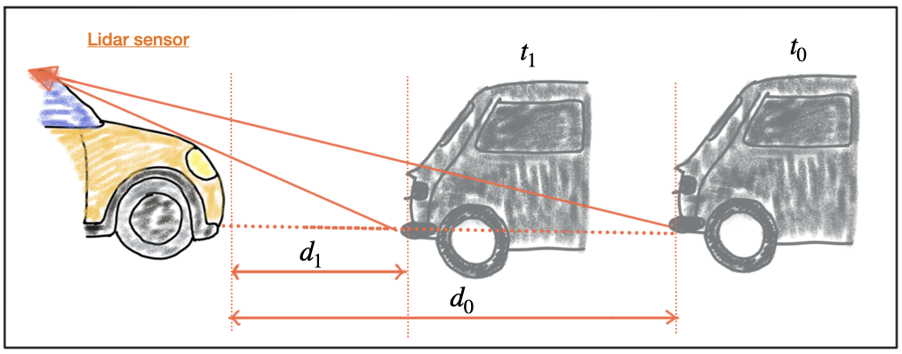
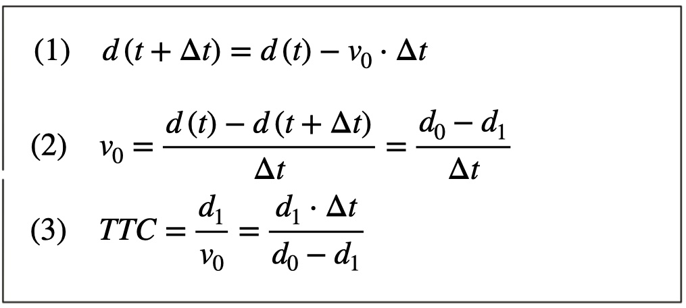
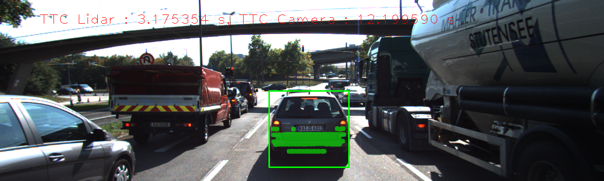

# Report

## FP.1 : Match 3D Objects

In this task, please implement the method "matchBoundingBoxes", which takes as input both the previous and the current data frames and provides as output the ids of the matched regions of interest (i.e. the boxID property)“. Matches must be the ones with the highest number of keypoint correspondences.

---

From the previous steps, we have already got the matched keypoints for the previous frame and the current frame and saved in "matches". The keypoints can be accessed by "queryIdx" and "trainIdx" respectively for each frame.

In each "DataFrame", the detected bounding box can be used to check if the matched keypoints are contained in it and accordingly find the matched boundingBoxes for the frames. The number of matched keypoints in the two boundingBoxes are saved in the table "pt_counts", from which we pick the pair that has the highest number as the matched boundingBoxes.

```cpp
void matchBoundingBoxes(std::vector<cv::DMatch> &matches, std::map<int, int> &bbBestMatches, DataFrame &prevFrame, DataFrame &currFrame)
{
    // based on the prevFrame's boundingBoxes to find the best match boundingBoxes in currFrame

    int p = prevFrame.boundingBoxes.size();
    int c = currFrame.boundingBoxes.size();

    int pt_counts[p][c] = {};

    for (auto it = matches.begin(); it != matches.end() - 1; ++it)
    {
        cv::KeyPoint query = prevFrame.keypoints[it->queryIdx];
        auto query_pt = cv::Point(query.pt.x, query.pt.y);
        bool query_found = false;

        cv::KeyPoint train = currFrame.keypoints[it->trainIdx];
        auto train_pt = cv::Point(train.pt.x, train.pt.y);
        bool train_found = false;

        std::vector<int> query_ids, train_ids;

        for (int i = 0; i < p; i++)
        {
            if (prevFrame.boundingBoxes[i].roi.contains(query_pt))
            {
                query_found = true;
                query_ids.push_back(i);
            }
        }

        for (int i = 0; i < c; i++)
        {
            if (currFrame.boundingBoxes[i].roi.contains(train_pt))
            {
                train_found = true;
                train_ids.push_back(i);
            }
        }

        if (query_found && train_found)
        {
            for (auto id_prev: query_ids)
            {
                for (auto id_curr: train_ids)
                {
                     pt_counts[id_prev][id_curr] += 1;
                 }
             }
        }

        for (int i = 0; i < p; i++)
        {
            int max_count = 0;
            int id_max = 0;
            for (int j = 0; j < c; j++)
            {
                if (pt_counts[i][j] > max_count)
                {
                    max_count = pt_counts[i][j];
                    id_max = j;
                }
                bbBestMatches[i]= id_max;
            }
        }

        bool bMsg = false;
        if (bMsg)
        {
            for (int i = 0; i < p; i++)
            {
                std::cout << "Box #" << i << " matches with " <<  " Box #" << bbBestMatches[i] << "." << std::endl;
            }
        }
    }
}
```

## FP.2 : Compute Lidar-based TTC

In this part of the final project, your task is to compute the time-to-collision for all matched 3D objects based on Lidar measurements alone. Please take a look at the "Lesson 3: Engineering a Collision Detection System" of this course to revisit the theory behind TTC estimation. Also, please implement the estimation in a way that makes it robust against outliers which might be way too close and thus lead to faulty estimates of the TTC. Please return your TCC to the main function at the end of computeTTCLidar.

---

Lidar is responsible for measuring the distances to the preceding vehicle in computing TTC here. We assume a Constant Velocity Model and use the closest 3D point lied on the preceding vehicle as the reference.

The following figures shows the distance measurements in two successive time points, "t0" and "t1" and accordingly "d0" and "d1" are the measured distances.



Based on the model of a constant-velocity, the velocity "v0" can be computed from two successive Lidar measurements as follows:



```cpp
void computeTTCLidar(std::vector<LidarPoint> &lidarPointsPrev,
                     std::vector<LidarPoint> &lidarPointsCurr, double frameRate, double &TTC)
{
    // auxiliary variables
    double dT = 1 / frameRate; // time between two measurements in seconds
    double laneWidth = 4.0; // assumed width of the ego lane

    // find closest distance to Lidar points within ego lane
    double minXPrev = 1e9, minXCurr = 1e9;
    for (auto it = lidarPointsPrev.begin(); it != lidarPointsPrev.end(); ++it)
    {
        if (abs(it->y) <= laneWidth / 2.0)
        { // 3D point within ego lane?
            minXPrev = minXPrev > it->x ? it->x : minXPrev;
        }
    }

    for (auto it = lidarPointsCurr.begin(); it != lidarPointsCurr.end(); ++it)
    {
        if (abs(it->y) <= laneWidth / 2.0)
        { // 3D point within ego lane?
            minXCurr = minXCurr > it->x ? it->x : minXCurr;
        }
    }

    // compute TTC from both measurements
    TTC = minXCurr * dT / (minXPrev - minXCurr);
}
```

## FP.3 : Associate Keypoint Correspondences with Bounding Boxes

Before a TTC estimate can be computed in the next exercise, you need to find all keypoint matches that belong to each 3D object. You can do this by simply checking whether the corresponding keypoints are within the region of interest in the camera image. All matches which satisfy this condition should be added to a vector. The problem you will find is that there will be outliers among your matches. To eliminate those, I recommend that you compute a robust mean of all the euclidean distances between keypoint matches and then remove those that are too far away from the mean.

---

The keypoint matches are stored in "kptMatches". By computing the average of the distances, we get the mean distance of the keypoint distances and will use it as a reference to remove outliers. For example, here we set a threshold as "dist_mean * 0.7" to remove the points that are out of this range.

```cpp
// associate a given bounding box with the keypoints it contains
void clusterKptMatchesWithROI(BoundingBox &boundingBox, std::vector<cv::KeyPoint> &kptsPrev, std::vector<cv::KeyPoint> &kptsCurr, std::vector<cv::DMatch> &kptMatches)
{
    double dist_mean = 0;
    std::vector<cv::DMatch> kptMatches_roi;
    for (auto it = kptMatches.begin(); it != kptMatches.end(); ++it)
    {
        cv::KeyPoint kp = kptsCurr.at(it->trainIdx);
        if (boundingBox.roi.contains(cv::Point(kp.pt.x, kp.pt.y)))
        {
            kptMatches_roi.push_back(*it);
        }
    }

    cout << "Find " << kptMatches_roi.size()  << " matches" << endl;

    for (auto it = kptMatches_roi.begin(); it != kptMatches_roi.end(); ++it)
    {
         dist_mean += it->distance;
    }

    if (kptMatches_roi.size() > 0)
    {
         dist_mean = dist_mean / kptMatches_roi.size();
    }
    else
    {
        return;
    }

    double threshold = dist_mean * 0.7;
    for (auto it = kptMatches_roi.begin(); it != kptMatches_roi.end(); ++it)
    {
       if (it->distance < threshold)
       {
           boundingBox.kptMatches.push_back(*it);
       }
    }

    cout << "Leave " << boundingBox.kptMatches.size() << " matches" << endl;
}
```

## FP.4 : Compute Camera-based TTC

Once keypoint matches have been added to the bounding boxes, the next step is to compute the TTC estimate. As with Lidar, we already looked into this in the second lesson of this course, so you please revisit the respective section and use the code sample there as a starting point for this task here. Once you have your estimate of the TTC, please return it to the main function at the end of computeTTCCamera.

---

Monocular cameras are not able to measure metric distances. To measure distance, a second camera would be needed. Given two images taken by two carefully aligned cameras (also called a stereo setup) at the same time instant, one would have to locate common points of interest in both images (e.g. the tail lights of the preceding vehicle) and then triangulate their distance using camera geometry and perspective projection.

Despite those limitations of the mono camera, let us see if there is a way to compute TTC without the need to measure distance. Let us consider the constant velocity motion model we introduced in a previous section of this course and think about a way to replace the metric distances d with something the camera can measure reliably, such as pixel distances directly on the image plane.

In the following figure, you can see how the height "H" of the preceding vehicle can be mapped onto the image plane using perspective projection. We can see that the same height "H" maps to different heights "h0" and "h1" in the image plane, depending on the distance "d0" and "d1" of the vehicle. It is obvious that there is a geometric relation between "h", "H", "d" and the focal length "f" of the pinhole camera - and this is what we want to exploit in the following.


The following set of equations are used here,


The distance ratio can be calculated from the relative distance ratio of keypoints in the successive frams.


In (a), a set of keypoints has been detected and the relative distances between keypoints 1-7 have been computed. In (b), 4 keypoints have been matched between successive images (with keypoint 3 being a mismatch).

```cpp
// Compute time-to-collision (TTC) based on keypoint correspondences in successive images
void computeTTCCamera(std::vector<cv::KeyPoint> &kptsPrev, std::vector<cv::KeyPoint> &kptsCurr,
                      std::vector<cv::DMatch> kptMatches, double frameRate, double &TTC, cv::Mat *visImg)
{
    // compute distance ratios between all matched keypoints
    vector<double> distRatios; // stores the distance ratios for all keypoints between curr. and prev. frame
    for (auto it1 = kptMatches.begin(); it1 != kptMatches.end() - 1; ++it1)
    { // outer kpt. loop

        // get current keypoint and its matched partner in the prev. frame
        cv::KeyPoint kpOuterCurr = kptsCurr.at(it1->trainIdx);
        cv::KeyPoint kpOuterPrev = kptsPrev.at(it1->queryIdx);

        for (auto it2 = kptMatches.begin() + 1; it2 != kptMatches.end(); ++it2)
        { // inner kpt.-loop

            double minDist = 100.0; // min. required distance

            // get next keypoint and its matched partner in the prev. frame
            cv::KeyPoint kpInnerCurr = kptsCurr.at(it2->trainIdx);
            cv::KeyPoint kpInnerPrev = kptsPrev.at(it2->queryIdx);

            // compute distances and distance ratios
            double distCurr = cv::norm(kpOuterCurr.pt - kpInnerCurr.pt);
            double distPrev = cv::norm(kpOuterPrev.pt - kpInnerPrev.pt);

            if (distPrev > std::numeric_limits<double>::epsilon() && distCurr >= minDist)
            { // avoid division by zero

                double distRatio = distCurr / distPrev;
                distRatios.push_back(distRatio);
            }
        } // eof inner loop over all matched kpts
    }     // eof outer loop over all matched kpts

    // only continue if list of distance ratios is not empty
    if (distRatios.size() == 0)
    {
        TTC = NAN;
        return;
    }

    // compute camera-based TTC from distance ratios
    std::sort(distRatios.begin(), distRatios.end());
    long medIndex = floor(distRatios.size() / 2.0);
    double medDistRatio = distRatios.size() % 2 == 0 ?
        (distRatios[medIndex - 1] + distRatios[medIndex]) / 2.0 : distRatios[medIndex]; // compute median dist. ratio to remove outlier influence

    double dT = 1 / frameRate;
    TTC = -dT / (1 - medDistRatio);
}
```

## FP.5 : Performance Evaluation 1

This exercise is about conducting tests with the final project code, especially with regard to the Lidar part. Look for several examples where you have the impression that the Lidar-based TTC estimate is way off. Once you have found those, describe your observations and provide a sound argumentation why you think this happened.

The task is complete once several examples (2-3) have been identified and described in detail. The assertion that the TTC is off should be based on manually estimating the distance to the rear of the preceding vehicle from a top view perspective of the Lidar points.

---

Below are some examples where Lidar-based TTC estimation is way off,

1. IMAGE 12


2. IMAGE 16



3. IMAGE 5


Noises and outliers are main possible reasons for those erroneous results.

Kalman filters can be used here to stabilizing the TTC variance.

## FP.6 : Performance Evaluation 2

This last exercise is about running the different detector / descriptor combinations and looking at the differences in TTC estimation. Find out which methods perform best and also include several examples where camera-based TTC estimation is way off. As with Lidar, describe your observations again and also look into potential reasons. This is the last task in the final project.

The task is complete once all detector / descriptor combinations implemented in previous chapters have been compared with regard to the TTC estimate on a frame-by-frame basis. To facilitate the comparison, a spreadsheet and graph should be used to represent the different TTCs.

---

Here is the top 3 detector & descriptor combinations:

1. FAST + BRIEF
2. FAST + ORB
3. FAST + BRISK

According to the result as shown in "camera_evaluation.csv" and the TTC measurements using Lidar, those three combinations are giving generally more robust and accurate TTC measurements.

Below are some examples where camera-based TTC estimation is way off,

1. HARRIS & BRIEF, IMAGE 15


2. ORB & BRIEF, IMAGE 8


3. ORB & FREAK, IMAGE 5


In the above examples, the erroneous TTC measures (negative or incredibly huge values) indicates the mismatches may have strongly influenced the final results.
